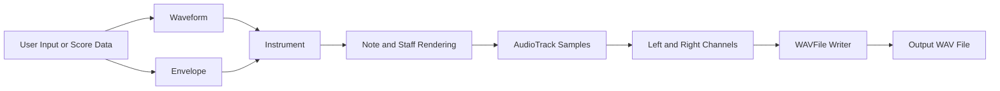
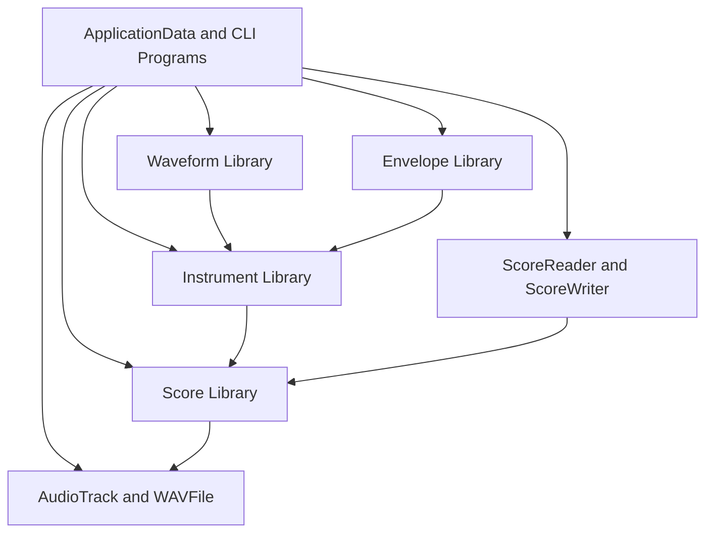

# wav-creator

## Description

`wav-creator` is a modular C++ audio synthesis project for generating `.wav` files from synthesized sound data. It provides reusable components for waveform generation, envelope shaping, instrument design, score modeling, and WAV file output.

## What It Does

- Generates audio tracks at a chosen sample rate, duration, and bit depth.
- Produces tones from waveform types such as sine, square, triangle, and sawtooth.
- Applies envelopes such as AD and ADSR to control how a sound changes over time.
- Combines waveforms and envelopes into instruments that can generate playable note data.
- Renders notes and staves from a musical score into audio samples.
- Writes stereo audio output to a valid WAV file.

## How It Works

The project is organized as a synthesis pipeline. A waveform produces the raw shape of a sound at a given frequency. An envelope then shapes that waveform's amplitude over time. These two pieces are combined into an instrument, which generates note samples. Notes are placed on musical staves, staves are collected into a score, and the rendered sample data is written into left and right audio channels. Finally, the WAV writer serializes those channels into a `.wav` file.

There are two main usage paths in the codebase:

- A direct WAV creation path, where the program configures audio settings, fills channel data, and writes the file.
- A score rendering path, where waveforms, envelopes, instruments, and notes are assembled into a score and then rendered into audio.

## Flow Diagram

## Component Diagram

## Core Concepts

- `Waveform`: Generates the raw shape of a sound, such as sine, square, triangle, or sawtooth.
- `Envelope`: Controls how amplitude changes over time, such as attack, decay, sustain, and release behavior.
- `Instrument`: Combines a waveform and an envelope to generate playable audio samples.
- `Note`: Represents a pitch and duration.
- `Staff`: Stores a timed sequence of notes associated with an instrument.
- `MusicalScore`: Groups together waveforms, envelopes, instruments, staves, tempo, and time signature data.
- `AudioTrack`: Holds rendered sample data for an audio channel.
- `WAVFile`: Writes rendered audio data to a binary `.wav` file.
